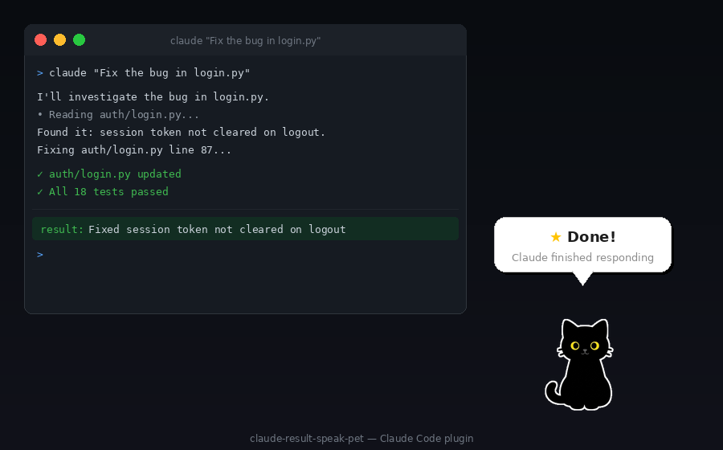

# claude-result-speak-cat

[日本語](README.ja.md)

A Claude Code plugin that shows a desktop pet in the bottom-right corner to deliver notifications.



## Features

- **Desktop pet** — an animated cat pops up in the bottom-right corner when Claude finishes
- **Speech bubble** — displays the notification message in a stylish bubble
- **Frame animation** — built-in multi-frame PNG animation
- **Auto-dismiss** — disappears after a configurable duration
- **Click to close** — click the pet to dismiss immediately
- **WSL2 support** — runs via PowerShell from WSL2
- **macOS support** — runs via Python 3 + tkinter

## Requirements

| Platform | Requirements |
|----------|-------------|
| WSL2 | `powershell.exe` (built-in) |
| macOS | Python 3 + `python-tk` (see below) |

### macOS: installing tkinter

Homebrew Python does not bundle tkinter. Install it separately:

```bash
brew install python-tk@3.13
```

> If you use a different Python version, replace `3.13` accordingly (e.g. `python-tk@3.12`).  
> python.org Python already includes tkinter — no extra step needed.

### macOS fallback behavior

| Python / Tk version | Result |
|---------------------|--------|
| Python 3 with Tk 8.6+ (Homebrew + python-tk / python.org) | Full pet image + animation |
| Python 3 with Tk 8.5 (Xcode CLT default) | 🐱 emoji instead of image |
| `python3` not found | System notification via `osascript` |

No `pip install` required in any case.

## Installation

```bash
claude plugin marketplace add https://github.com/qvtec/claude-result-speak-cat.git
claude plugin install claude-result-speak-cat@claude-result-speak-cat
```

Then enable the plugin:

```bash
# All projects (recommended)
claude plugin enable --scope user claude-result-speak-cat@claude-result-speak-cat

# Current project only
claude plugin enable --scope project claude-result-speak-cat@claude-result-speak-cat
```

## Configuration

Add an `env` block to `~/.claude/settings.json`:

```json
{
  "env": {
    "CLAUDE_RESULT_SPEAK_CAT_LANGUAGE": "ja",
    "CLAUDE_RESULT_SPEAK_CAT_DISPLAY_SECONDS": "8"
  }
}
```

| Environment variable | Type | Default | Description |
|---------------------|------|---------|-------------|
| `CLAUDE_RESULT_SPEAK_CAT_LANGUAGE` | string | `en` | Notification language (`ja` / `en` / `cat`) |
| `CLAUDE_RESULT_SPEAK_CAT_DISPLAY_SECONDS` | number | `5` | How long the pet stays on screen (2–30) |
| `CLAUDE_RESULT_SPEAK_CAT_MESSAGE_COMPLETE` | string | _(language default)_ | Completion message override |
| `CLAUDE_RESULT_SPEAK_CAT_MESSAGE_PERMISSION` | string | _(language default)_ | Permission prompt message override |
| `CLAUDE_RESULT_SPEAK_CAT_MESSAGE_IDLE` | string | _(language default)_ | Idle message override |

Set `LANGUAGE=cat` to enable Japanese cat-speak (にゃ language).

## Using with claude-result-speak

This plugin pairs well with [claude-result-speak](https://github.com/qvtec/claude-result-speak), which adds TTS (text-to-speech). Since the pet handles visual notifications, disable the balloon popup in the original plugin to avoid duplicates.

Add to `~/.claude/settings.json`:

```json
{
  "env": {
    "CLAUDE_RESULT_SPEAK_NOTIFY_ENABLED": "false"
  }
}
```

This keeps TTS while letting the pet handle notifications.

## Security & Privacy

- **No network access** — notification content never leaves your machine
- **No external packages** — no third-party dependencies means no supply chain risk
- **Fully local** — only plugin scripts and OS built-ins are executed

## License

MIT
